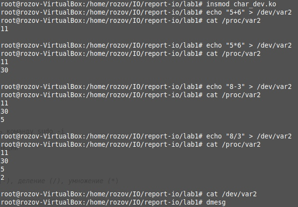
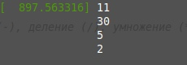

# Лабораторная работа 1

**Название:** "Разработка драйверов символьных устройств"

**Цель работы:** получить знания и навыки разработки драйверов символьных устройств для операционной системы Linux.

## Описание функциональности драйвера

При записи в файл символьного устройства текста типа “5+6” должен запоминаться результат операции, то есть 11 для данного примера. Должны поддерживаться операции сложения, вычитания, умножения и деления. Последовательность полученных результатов с момента загрузки модуля ядра должна выводиться при чтении созданного файла /proc/varN в консоль пользователя.

При чтении из файла символьного устройства в кольцевой буфер ядра должен осуществляться вывод тех же данных, которые выводятся при чтении файла /proc/varN.


## Инструкция по сборке

1. Склонировать репозиторий
    git clone .... 
2. Собрать проект
    - cd ...
    - make

## Инструкция пользователя
0. Произвести сборку проекта
1. Загрузить собранный модуль
    - sudo insmode char_dev.ko
2. Произвести необходимые действия
3. Выгрузить модуль
    - sudo rmmode char_dev
*Примечание: чтобы не писать sudo, можно вызвать команду sudo -i
 
П.2. подразумевает собой выполение следующих функций

```bash
echo "value_1operationvalue_2" > /dev/var2
```
- value_1 - первое значение
- оperation - операция: сложение (+), вычитание (-), деление (/), умножение (*)
- value_2 - второе значение
- Текст подается без пробелов
- Пример, echo "5+6" > /dev/var2

```bash
cat /dev/var2
dmesg

cat proc/var2
```

## Примеры использования



