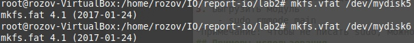

# Лабораторная работа 2

**Название:** "Разработка драйверов блочных устройств"

**Цель работы:** Получить знания и навыки разработки драйверов блочных устройств для операционной системы Linux

## Описание функциональности драйвера

Драйвер должен создавать виртуальный жесткий диск в оперативной  памяти с размером 50 Мбайт. 
Созданный диск должен быть разбит на разделы: Два первичных и один расширенный разделы с размерами  10Мбайт, 20Мбайт и 20Мбайт соответственно. Расширенный  раздел должен быть разделен на два логических с размерами  по 10Мбайт каждый. 

## Инструкция по сборке

1. Склонировать репозиторий
    git clone https://github.com/nikaalin/ioSystems 
2. Собрать проект
    - cd /ioSystems/lab2
    - make

## Инструкция пользователя

0. Произвести сборку проекта (см. Инструкцию по сборке)
1. Загрузить собранный модуль
    - sudo insmode main.ko
2. Произвести необходимые действия (см. Примеры использования)
3. Выгрузить модуль
    - sudo rmmode main
*Примечание: чтобы не писать sudo, можно вызвать команду sudo -i

## Примеры использования
lsblk - команда для просмотра списка примонтированных дисков Linux  с информацией о точке монтирования, типе раздела (диск, раздел, привод) и его мажорном и минорном номере, по которым можно понять, что это за устройство

mkfs.vfat /dev/mydiskN - форматирование разделов диска

sync; dd if=input_file of=output_file bs=1M count=1024; sync - команда для определения скорости ЗАПИСИ на накопитель

Замер скорости передачи данных при копировании файлов между разделами созданного виртуального диска. 

Замер скорости передачи данных при копировании файлов между разделами виртуального и реального жестких дисков. 

