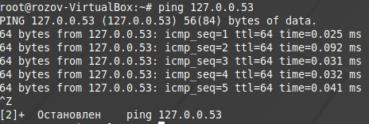
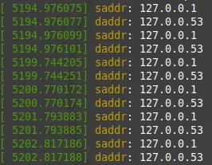
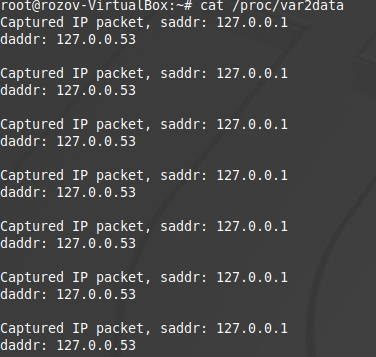
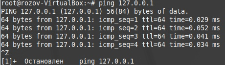
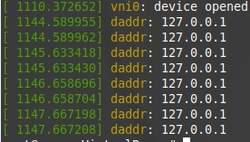
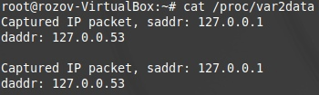

# Лабораторная работа 3

**Название:** "Разработка драйверов сетевых устройств"

**Цель работы:** получить знания и навыки разработки драйверов сетевых интерфейсов для операционной системы Linux.

## Описание функциональности драйвера

Драйвер должен создавать виртуальный сетевой интерфейс в ОС Linux.
Созданный сетевой интерфейс должен перехватывать пакеты родительского интерфейса (eth0 или другого).
Сетевой интерфейс должен реализовывать логику работы с перехваченным трафиком:
 - Пакеты протокола IPv4, адресуемые конкретному IP. Вывести IP адреса отправителя и получателя.
 - Состояние разбора пакетов необходимо выводить в файл в директории /proc
Должна иметься возможность просмотра статистики работы созданного интерфейса.

## Инструкция по сборке

1. Склонировать репозиторий
    git clone https://github.com/nikaalin/ioSystems 
2. Собрать проект
    - cd /ioSystems/lab3
    - make

## Инструкция пользователя

0. Произвести сборку проекта (см. Инструкцию по сборке)
1. Загрузить собранный модуль
    - sudo insmod virt_net_if.ko
2. Произвести необходимые действия (см. Примеры использования)
3. Выгрузить модуль
    - sudo rmmod virt_net_if
   
*Примечание: чтобы не писать sudo, можно вызвать команду sudo -i

## Примеры использования
ping 127.0.0.53 - тест конкретного IP (в нашем случае 127.0.0.53)

cat /proc/var2data - вывод информации о состояянии разбора пакетов

Пример с другим IP

